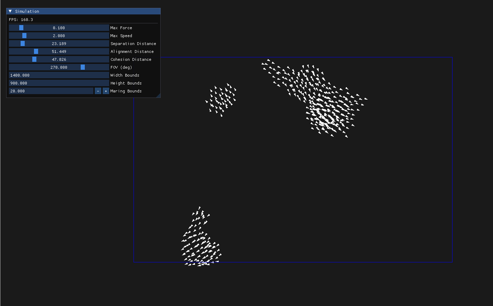

# Boids Simulation

This project implements the 2D Boids algorithm to simulate the flocking behavior of birds.


## Images


## Build
```bash
make buildAll
make
```

## References

1. Reynolds, C. W. (1999). *Steering Behaviors For Autonomous Characters.*

## TODO
- [ ] Avoiding Environmental Obstacles
- [ ] Optimize Simulation
